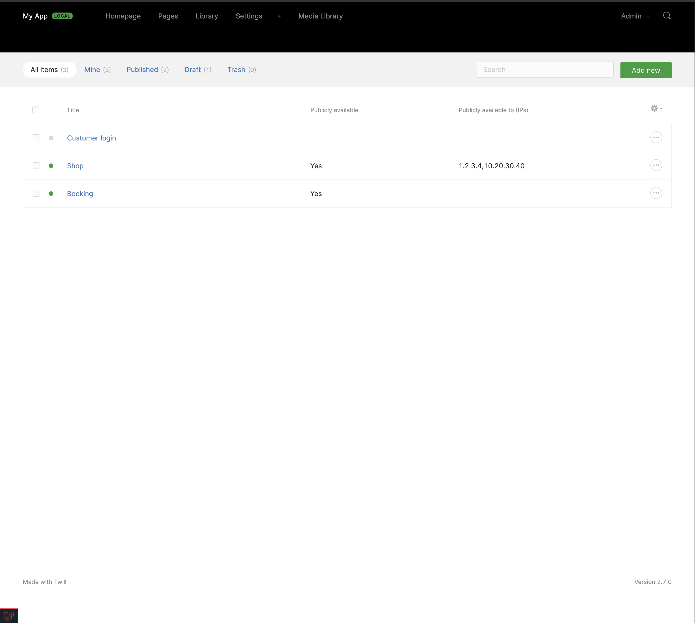
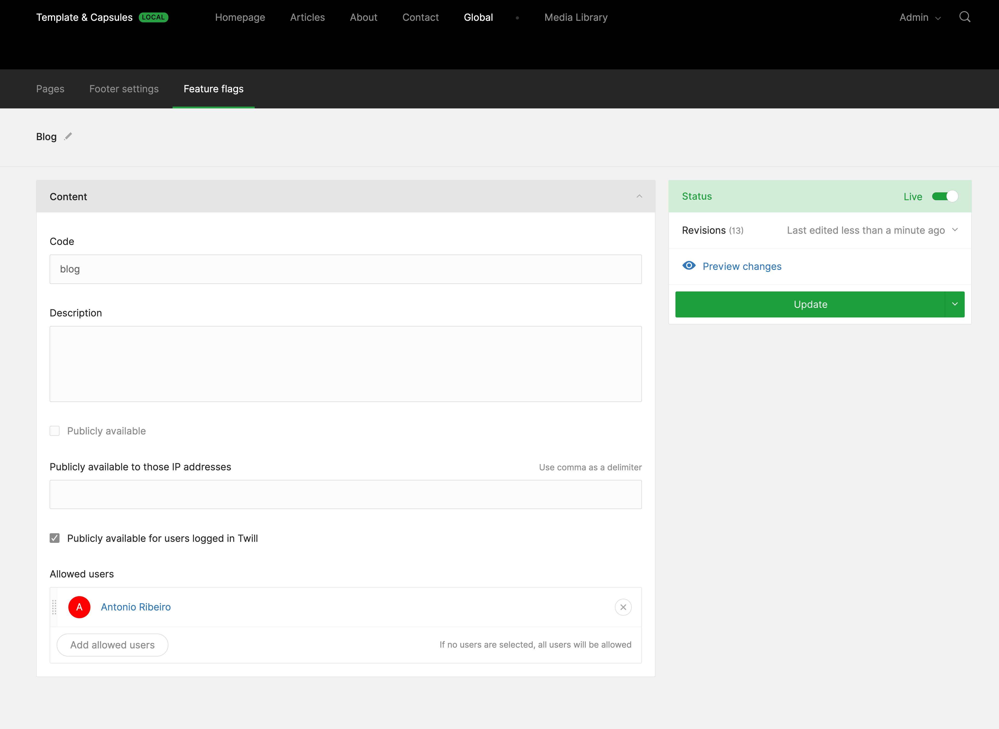

# Feature Flags
## Twill Capsule

### Description

This Capsule allows you to easily enable/disable features on your application. Features not flagged to be available publicly will still be available on non-public domains. This way company staff and QA teams can still test these features on hiden domains, even if they are served by the same server/database.





## Installing

Clone the repository inside your app/Twill/Capsules folder. 

```
cd app/Twill/Capsules
git clone https://github.com/area17/twill-capsule-feature-flags.git
mv twill-capsule-feature-flags FeatureFlags
```

Enable the Capsule in config/twill.php:

``` php
    'capsules' => [
        'list' => [
            [
                'name' => 'FeatureFlags',
                'enabled' => true,
            ],
            ...
```

Load Capsule helpers by adding calling the loader to your AppServiceProvider:

``` php
/**
 * Register any application services.
 *
 * @return void
 */
public function register()
{
    \App\Twill\Capsules\FeatureFlags\Services\Helpers::load();
}
```

Add a configuration to config/app.php, to set your public available domains

``` php 
/*
|--------------------------------------------------------------------------
| Domains
|--------------------------------------------------------------------------
|
*/

'domains' => [
    'publicly_available' => explode(',', env('PUBLICLY_AVAILABLE_DOMAINS')),
],
```
 
Add the production domains list (comma separated) to your .env file:

``` 
PUBLICLY_AVAILABLE_DOMAINS=my-production-domain.com
```  

## Using

Once installed and configured, you can go to https://your-domain/featureFlags to create/enable/disable feature flags.

And, on your code, you can just use the helper to show/hide features from your website:

``` php 
if (feature('booking')) {
    require __DIR__ . '/routes.php';
}
```

Or in Blade:

``` php 
@include('partials.global.head', ['noIndex' => !feature('feature-x')])

@if(feature('booking'))
    // Render the feature
@endif
```

Don't forget to add the feature flags to your navigation too.
